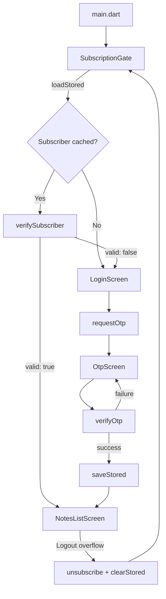
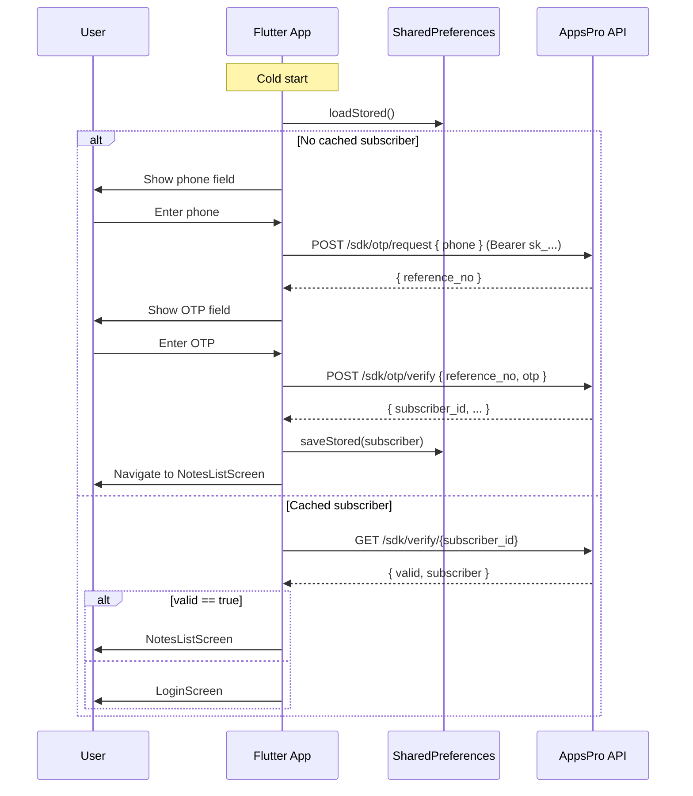

## Plan: Clean Notes Subscription Gate

**TL;DR.** Insert a `SubscriptionGate` widget at the root of `NotesApp` that boots from `shared_preferences`. When unverified, it renders a two-step `LoginScreen` (phone → OTP) that calls the AppsPro `/api/v1/sdk/otp/request` and `/otp/verify` endpoints via `http`. On success, the `subscriberId` is persisted and the gate swaps to `NotesListScreen`. The existing notes code is untouched except `main.dart`'s `home:` and a package rename ("Clean Notes"). Public keys, URLs, and slugs are concentrated in `lib/config/appspro_config.dart`.

**Steps**

1. **Rename app to "Clean Notes".** Update `pubspec.yaml` `description` and `MaterialApp.title` in `lib/main.dart` to "Clean Notes". Update `web/manifest.json` `name` and `short_name`. (parallel with 2)
2. **Add dependencies.** Add `http: ^1.2.2` and `shared_preferences: ^2.3.0` to `pubspec.yaml` under `dependencies`; run `flutter pub get`. (parallel with 1)
3. **Create `lib/config/appspro_config.dart`.** A small `const class` holding `baseUrl`, `secretKey`, `publishableKey`, `urlSlug`, `checkoutUrl`, and a `verifyUrl(subscriberId)` helper. This is the single source of truth for the credentials from the dashboard. (depends on 1)
4. **Create `lib/models/subscriber.dart`.** Immutable record with `subscriberId`, `phone`, `verifiedAt`. Add `toJson` / `fromJson` for `shared_preferences` storage. (depends on 2)
5. **Create `lib/services/subscription_service.dart`.** Stateless service that:
   - `requestOtp(phone)` → POST `https://api.appspro.dev/api/v1/sdk/otp/request` with `Authorization: Bearer <secret_key>` and body `{ "phone": phone }`. Returns `reference_no`.
   - `verifyOtp(referenceNo, otp)` → POST `/api/v1/sdk/otp/verify` with body `{ "reference_no", "otp" }`. Returns `Subscriber` on success; throws `SubscriptionException` on failure (with `status_detail` message).
   - `verifySubscriber(subscriberId)` → GET `/api/v1/sdk/verify/<subscriber_id>` for re-validation on cold start.
   - `unsubscribe(phone)` → POST `/api/v1/sdk/unsubscribe` (used by the "Unsubscribe" logout action).
   - `loadStored()` / `saveStored()` / `clearStored()` wrapping `SharedPreferences`.
   - Reference: the AppsPro guideline notes a 10/h rate limit per phone for `otp/request`.

6. **Create `lib/screens/subscription_gate.dart`.** A `StatefulWidget` that on `initState` calls `SubscriptionService.loadStored()`. While loading, renders a `CircularProgressIndicator`. Loads re-verify via `verifySubscriber`; if `valid`, switch to `NotesListScreen`. Otherwise show `LoginScreen`. Also exposes a `logout` method invoked from the notes AppBar. (depends on 4, 5)
7. **Create `lib/screens/login_screen.dart`.** A `StatefulWidget` with two states (`phone` and `otp`). Form-validated phone field (digits-only, BD format `01XXXXXXXXX`); on submit calls `requestOtp` and transitions to OTP step. OTP step shows 6-digit fields, a 60-second resend timer, and on submit calls `verifyOtp`. On success, `SubscriptionService.saveStored` and notify the gate via `Navigator.pop` with a `Subscriber` result. Branded with the same indigo color scheme as the existing app. (depends on 5)
8. **Create `lib/screens/subscription_success_screen.dart`.** Optional post-OTP confirmation screen shown briefly before routing to notes. Keeps the "Welcome to Clean Notes" copy and a "Continue" button. (depends on 7)
9. **Wire `lib/main.dart` to the gate.** Change `MaterialApp.home:` to `SubscriptionGate(service: subscriptionService)`. Pass `subscriptionService` and `notesService` into the gate so it can render the notes list once verified. Keep all existing theme code. (depends on 6)
10. **Add an "Unsubscribe / Log out" overflow menu** to `NotesListScreen`'s AppBar that calls `SubscriptionService.unsubscribe(phone)` then `clearStored()`, and re-mounts the gate via `Navigator.pushAndRemoveUntil`. (depends on 9)
11. **(Parallel) Android: keep `INTERNET` permission in `AndroidManifest.xml` (default).** iOS: keep ATS allow for `api.appspro.dev` (the default dev config allows https). Windows: the existing `webview_flutter` is not in scope but `http` already works.
12. **Manual verification.** Run `flutter pub get`, then `flutter run` on Android emulator. First launch should show phone entry. Request OTP (real SMS dep): valid phone receives SMS, OTP screen appears, submit, notes screen appears. Cold restart the app — should land directly on notes. Tap "Logout" → returns to phone entry. Invalid OTP → error snackbar with `status_detail`.

**Security note (callout in README, not a code step).** The webhook secret (`sk_dec251b804d78ea8d48267e28c5e1d779924827d33125cdf`) is stored in the Flutter client. This is acceptable for a demo / assignment workspace but is not production-safe — anyone can decompile the APK and extract the key. For production, route `/otp/*` calls through a backend (Firebase Cloud Function) and keep `secret_key` server-side.

**Relevant files**
- `lib/main.dart` — change `MaterialApp.title` to "Clean Notes", change `home:` to `SubscriptionGate`.
- `lib/config/appspro_config.dart` — **new**, holds `baseUrl`, `secretKey`, `publishableKey`, `urlSlug`.
- `lib/models/subscriber.dart` — **new**.
- `lib/services/subscription_service.dart` — **new**.
- `lib/screens/subscription_gate.dart` — **new**, the cold-start gate.
- `lib/screens/login_screen.dart` — **new**, phone + OTP UI.
- `lib/screens/subscription_success_screen.dart` — **new**, optional.
- `lib/screens/notes_list_screen.dart` — add overflow menu with "Unsubscribe / Log out".
- `lib/services/notes_service.dart` — no change (passed through the gate).
- `pubspec.yaml` — add `http`, `shared_preferences`.
- `web/manifest.json` — rename `name` / `short_name` to "Clean Notes".

**Diagrams**

**Verification**
1. `flutter pub get` succeeds; `flutter analyze` reports no errors.
2. Fresh install: app opens on the phone-entry screen, no notes are visible.
3. Submitting a valid BD phone triggers `otp/request`; the response includes a `reference_no` shown in debug logs.
4. Submitting the real SMS OTP against `otp/verify` returns a `subscriber_id`; the app replaces the gate with `NotesListScreen`.
5. Cold-restarting the app bypasses the login screen and goes directly to notes.
6. Tapping "Logout" in the notes AppBar calls `unsubscribe`, clears prefs, and re-mounts the gate — the next launch shows the login screen again.
7. Invalid OTP shows a `SnackBar` with `status_detail` from the API response; the user stays on the OTP screen.
8. No `secret_key` leakage outside `lib/config/appspro_config.dart` (grep confirms only that file references it).
