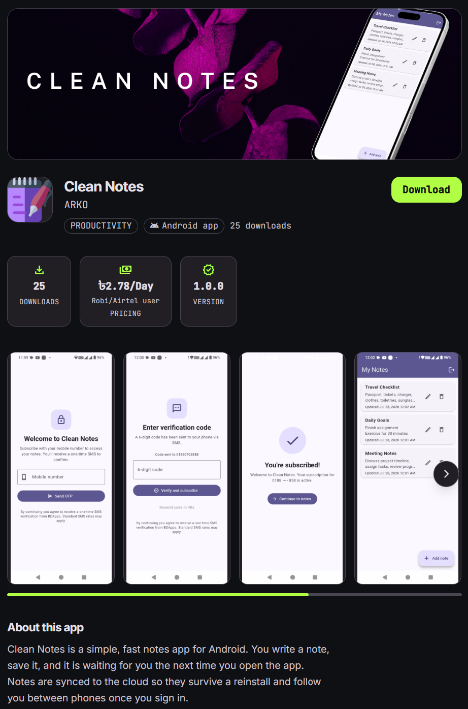

<div align="center">

# Clean Notes

**A simple, fast notes app for Android. Syncs to the cloud. Subscribes through your mobile carrier billing.**

<br>

[](https://appspro.dev/app/CkFUYUsruI)

<br>


</div>

---

## Table of Contents

1. [What is Clean Notes](#what-is-clean-notes)
2. [Features](#features)
3. [Tech Stack](#tech-stack)
4. [Platform](#platform)
5. [Subscription & Billing](#subscription--billing)
6. [Project Layout](#project-layout)
7. [Quick Start](#quick-start)
8. [Architecture](#architecture)
9. [Documentation](#documentation)
10. [License](#license)

---

## What is Clean Notes

Clean Notes is a paid notes app for Android, built with Flutter.

<br>

<div align="center">
  <a href="https://appspro.dev/app/CkFUYUsruI">
    
  </a>
</div>

<br>


You write a note, save it, and it is waiting for you the next time
you open the app. Notes are stored in the cloud, so they survive a
reinstall, a phone change, or a factory reset.

The app is gated by an AppsPro / BDApps subscription at **BDT 2/=
per day**, billed to your mobile phone bill by your operator.

---

## Features

<div align="center">

| Feature | Description |
|---|---|
| ✏️ **Create** | Add a note with a title and description. |
| 👁️ **View** | Every note is shown in a live-updating list, most-recently-edited first. |
| 🔧 **Update** | Tap any note to change its title or description. The `updatedAt` timestamp refreshes automatically. |
| 🗑️ **Delete** | Remove a note with a confirmation dialog. |
| 🔐 **Per-user isolation** | Each subscriber's notes are stored under their own user space in Cloud Firestore. Two accounts on the same device cannot see each other's notes. |
| ☁️ **Cloud sync** | Notes are backed up to Firebase. New notes save locally first and sync when you are online again. |
| 📴 **Offline reading** | Notes you have already opened are available without internet. |
| 🇧🇩 **Carrier billing** | BDT 2/= per day, added to your mobile bill by your operator through AppsPro / BDApps. No card or bank account needed. |
| 🚪 **Self-service unsubscribe** | Logout and cancel your subscription from inside the app. |

</div>

---

## Tech Stack

<div align="center">

| Layer | Technology |
|---|---|
| **Framework** | Flutter 3.x |
| **Language** | Dart 3.12+ |
| **UI** | Material 3 |
| **Backend** | Firebase (`firebase_core` 4.x, `cloud_firestore` 6.x, `firebase_auth` 6.5.4 — anonymous) |
| **Subscription billing** | AppsPro / BDApps REST SDK — `https://api.appspro.dev/api/v1` |
| **Networking** | `package:http` (direct HTTPS) |
| **Local storage** | SharedPreferences (subscriber record only) |
| **Build** | Gradle (Kotlin DSL), Android Gradle Plugin, JDK 17 |
| **Signing** | Release keystore (not included in source) |

</div>

---

## Platform

| Property | Value |
|---|---|
| **Operating system** | Android |
| **Minimum version** | Android 5.0 (Lollipop, API 21) |
| **Target version** | Android 14 (API 34) |
| **Architectures** | arm64-v8a, armeabi-v7a, x86_64 |
| **iOS, web, desktop** | Not built or supported in this release |

---

## Subscription & Billing

Clean Notes is provided as a paid service through the Bangladeshi
carrier billing platform (AppsPro / BDApps).

| | |
|---|---|
| **Price** | **BDT 2/= per day** (about BDT 60/= per 30-day month) |
| **How you pay** | Added to your mobile phone bill by your operator |
| **How to subscribe** | Open the app, enter your Bangladeshi mobile number, verify the OTP |
| **How to unsubscribe** | Tap *Logout / Unsubscribe* at the bottom of the notes list |
| **Listing** | [**appspro.dev/app/CkFUYUsruI**](https://appspro.dev/app/CkFUYUsruI) |

It may take up to 24 hours for an unsubscribe to fully reflect on
your operator bill. If the BDT 2/= daily charge still appears after
24 hours, contact your mobile operator.

---

## Project Layout

```text
lib/
├── main.dart                            # App entry, Firebase bootstrap, auth try/catch
├── firebase_options.dart                # Generated by `flutterfire configure`
├── config/
│   └── appspro_config.dart              # AppsPro base URL + secret key
├── models/
│   ├── note.dart                        # Note entity + Firestore (de)serialisation
│   └── subscriber.dart                  # Subscriber record (phone, subscriber_id)
├── services/
│   ├── notes_service.dart               # Firestore CRUD wrapper, per-user scoped
│   └── subscription_service.dart        # AppsPro / BDApps REST wrapper
├── screens/
│   ├── login_screen.dart                # Phone entry + OTP request
│   ├── subscription_gate.dart           # Subscription wall + state machine
│   ├── subscription_success_screen.dart # Post-verify confirmation
│   ├── notes_list_screen.dart           # Home screen — live list + add FAB
│   └── note_editor_screen.dart          # Add / edit form
└── widgets/
    └── note_tile.dart                   # Single-row presentation
```

---

## Quick Start

See **[FIREBASE_SETUP.md](./FIREBASE_SETUP.md)** for the full
Firebase / Firestore setup walkthrough. See
**[APPSPRO_INTEGRATION.md](./APPSPRO_INTEGRATION.md)** for the
AppsPro / BDApps credential setup and the subscribe / unsubscribe
flow.

TL;DR:

```powershell
flutter pub get
flutterfire configure --project=<your-project-id>
flutter run
```

Build a release APK:

```powershell
flutter build apk --release
```

The signed APK lands at
`build\app\outputs\flutter-apk\app-release.apk`.

---

## Architecture

- **Single source of truth** — the UI subscribes to a Firestore
  stream; there is no local cache for notes. This keeps the code
  short and matches the assignment scope.
- **`NotesService` isolates Firestore APIs** — the screens never
  touch `FirebaseFirestore` directly. Swap it for a mock or REST
  client in tests.
- **`SubscriptionService` isolates AppsPro APIs** — the screens
  never touch the BDApps HTTP endpoints directly. Errors throw
  `SubscriptionException`; the UI catches them and shows a
  snackbar.
- **Per-user data isolation** — every Firestore query is scoped
  by the current `firebase_auth` user UID. Two subscribers on the
  same device see two independent notes lists.
- **No business logic in widgets** — validation lives in the form,
  persistence lives in the service, presentation lives in the
  tile.
- **Material 3** themed with a single seeded `ColorScheme`.
- **Anonymous Firebase Authentication** is used at boot to give
  the app a stable per-device identity for Firestore rules, with
  a defensive try/catch around the bootstrap so a misconfigured
  Firebase project does not blank-crash the app on startup.

---

## Documentation

| File | Purpose |
|---|---|
| **[USER_MANUAL.txt](./USER_MANUAL.txt)** | End-user guide: install, subscribe, use, unsubscribe. |
| **[RELEASE_NOTES.md](./RELEASE_NOTES.md)** | Release notes and user-facing app description ([v1.0.0 Release](https://github.com/AbirHasanArko/Clean-Notes/releases/tag/v1.0.0)). |
| **[FIREBASE_SETUP.md](./FIREBASE_SETUP.md)** | Firebase project setup and Firestore rules. |
| **[APPSPRO_INTEGRATION.md](./APPSPRO_INTEGRATION.md)** | AppsPro / BDApps setup, endpoints, secret-key handling. |

---

## Author & Credits

**Developed by:** Abir Hasan Arko

**Powered by:** [BDApps](https://dev.bdapps.com) & [AppsPro](https://appspro.dev)

---
